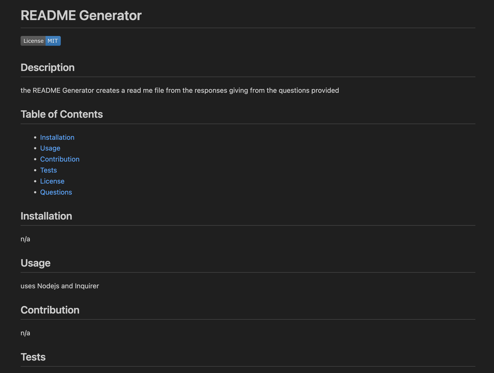
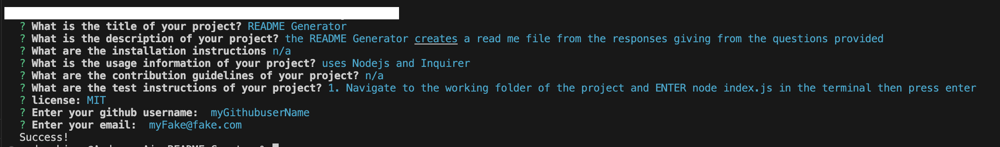

# README-Creator

## Building a README-Creator

The purpose of this project is to create a ReadMe file that includes everything needed to have a good README file. Developing this project demonstrates our entry into server-side programming.
This project was developed with Inquirer version 8.2.4. Using Inquirer assisted in forming and structuring of our questions and responses.  

The following is an image of a newly generated README file application.

The Following image are the questions the application used to create the readme file.

## Installation

N/A

## Usage

To view the application in action, simply click the following link: https://gah-mewbittik.github.io/City-Forecast/
The link will redirect you to a video demonstration of the application in action. The README-Creator application functionality generates specific questions related to README file content requirements and generates a professional README file from the users's responses.  

## Credits

N/A

## License

Please refer to the LICENSE in the repo.